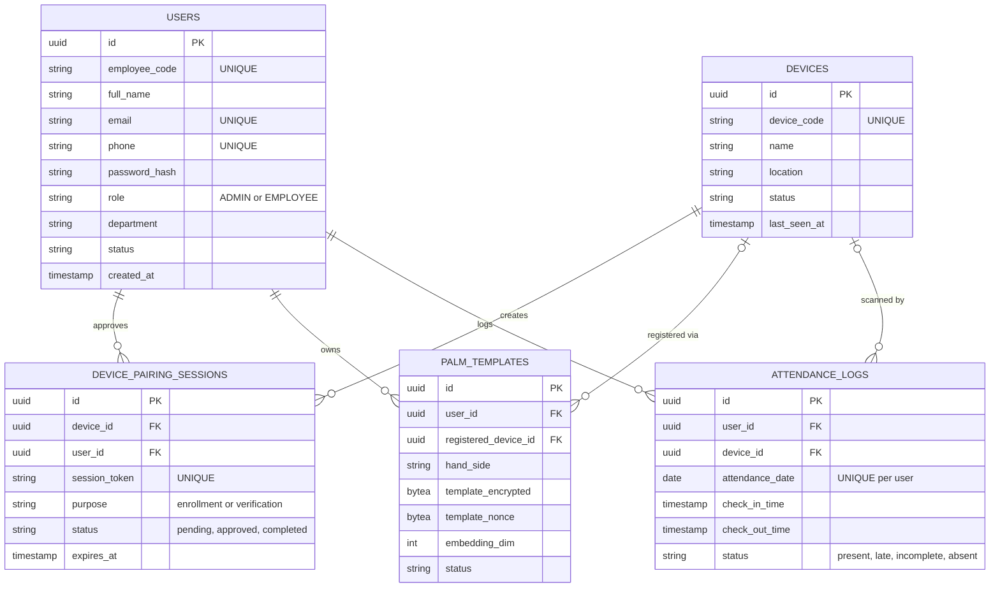
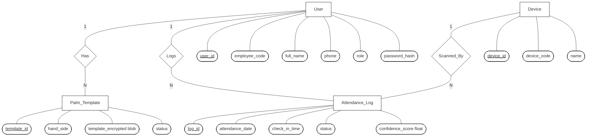

# Palm Recognition Attendance System - User Manual

Welcome to the User Manual! This document provides a high-level explanation of how the system works, its core workflows, and the data model behind it. This guide is designed to be easily understood by both administrators and standard users.

---

## 1. What Does This Project Do?

This project is a modern **Biometric Attendance System** that uses palm recognition technology. Instead of using keycards or passwords, employees simply place their hand over a scanner to check in and out of work. 

The system consists of three main parts:
1. **Web Admin Dashboard:** Used by HR or Administrators to manage users, devices, and view attendance reports.
2. **Physical Scanners (Hardware Devices):** The actual machines stationed at entrances that scan palms.
3. **Mobile App / Employee Portal:** Used by employees to securely pair their palm with their account and view their own attendance history.

---

## 2. Core Workflows (How to Use It)

### Phase 1: Initial Setup (Admin)
Before employees can start checking in, the system needs to be set up:
1. **Create Employees:** The Admin logs into the Web Dashboard and creates profiles for all employees (assigning them employee codes and roles).
2. **Register Devices:** The Admin registers the physical palm scanners in the system (e.g., "Main Entrance Scanner", "Back Door Scanner") so the server knows which machines are authorized.

### Phase 2: Palm Enrollment (The Pairing Flow)
An employee cannot check in until their palm is securely linked to their account. This is a one-time process:
1. **Start Pairing:** The physical scanner displays a QR code on its screen.
2. **Scan QR:** The employee logs into their mobile app and scans the scanner's QR code.
3. **Approve:** The employee clicks "Approve" on their phone. This temporarily links their phone to that specific scanner.
4. **Scan Palm:** The scanner prompts the employee to place their hand over the sensor. The machine reads the palm, encrypts the data, and saves it to the employee's database profile.

### Phase 3: Daily Attendance (Checking In/Out)
Once enrolled, daily usage is completely frictionless:
1. **Walk Up & Scan:** The employee walks up to any registered scanner and places their hand over it.
2. **Automatic Logging:** The scanner instantly recognizes the palm and marks them as "Present" or "Late" for the day. If they scan again later, it updates their "Check Out" time.

### Phase 4: Reporting & Dashboard
1. **Live Monitoring:** The Admin can view a live dashboard showing who is present, absent, or late today.
2. **Generate Reports:** At the end of the month, the Admin can filter by Month and Department to generate automated attendance summaries for payroll.

---

## 3. Entity-Relationship (ER) Model

Below is the database structure that powers the system, showing how Users, Devices, Palm Templates, and Attendance Logs are connected.

### 3.1 Chen's E-R Notation

Here is the database structure of the Palm Recognition Attendance System modeled in Chen's E-R notation style:

### Understanding the Relationships:
* **Users & Palm Templates (1-to-Many):** One user can have multiple palm templates (e.g., left hand, right hand).
* **Users & Attendance (1-to-Many):** One user has many attendance logs (one per day).
* **Devices & Sessions (1-to-Many):** A device generates unique pairing sessions (QR codes) for users to scan.
* **Devices & Attendance (1-to-Many):** A device processes many attendance check-ins.
