# Palm Recognition Attendance System - User Manual

Welcome to the User Manual! This document provides a high-level explanation of how the system works, its core workflows, and the data model behind it. This guide is designed to be easily understood by both administrators and standard users.

---

## 1. What Does This Project Do?

This project is a modern **Biometric Attendance System** that uses palm recognition technology. Instead of using keycards or passwords, employees simply place their hand over a scanner to check in and out of work. 

The system consists of three main parts:
1. **Web Admin Dashboard:** Used by HR or Administrators to manage users, devices, and view attendance reports.
2. **Physical Scanners (Hardware Devices):** The actual machines stationed at entrances that scan palms.
3. **Mobile App / Employee Portal:** Used by employees to securely pair their palm with their account and view their own attendance history.

---

## 2. Core Workflows (How to Use It)

### Phase 1: Initial Setup (Admin)
Before employees can start checking in, the system needs to be set up:
1. **Create Employees:** The Admin logs into the Web Dashboard and creates profiles for all employees (assigning them employee codes and roles).
2. **Register Devices:** The Admin registers the physical palm scanners in the system (e.g., "Main Entrance Scanner", "Back Door Scanner") so the server knows which machines are authorized.

### Phase 2: Palm Enrollment (The Pairing Flow)
An employee cannot check in until their palm is securely linked to their account. This is a one-time process:
1. **Start:** The administrator or employee clicks "Enroll New Palm" on the physical scanner's touchscreen.
2. **QR Code:** The scanner displays a unique QR code on its screen.
3. **Approve:** An Administrator scans the QR code using the admin app/dashboard and enters the employee's ID code. This temporarily links the scanner session to that specific employee.
4. **Scan Palm:** The scanner prompts the employee to place their hand over the sensor. The machine reads the palm, encrypts the data, and saves it to the employee's database profile.

**Note on Revocation:** If an employee needs to re-register their palm (e.g., they injured their hand), they cannot delete their own palm template from the mobile app for security reasons. Only an Administrator can remove or revoke a palm template using the Web Admin Dashboard.

### Phase 3: Daily Attendance (Checking In/Out)
Once enrolled, daily usage is completely frictionless:
1. **Walk Up & Scan:** The employee walks up to any registered scanner and places their hand over it.
2. **Automatic Logging:** The scanner instantly recognizes the palm and marks them as "Present" or "Late" for the day. If they scan again later, it updates their "Check Out" time.

### Phase 4: Reporting & Dashboard
1. **Live Monitoring:** The Admin can view a live dashboard showing who is present, absent, or late today.
2. **Generate Reports:** At the end of the month, the Admin can filter by Month and Department to generate automated attendance summaries for payroll.

---

## 3. Entity-Relationship (ER) Model

Below is the database structure that powers the system, showing how Users, Devices, Palm Templates, and Attendance Logs are connected.

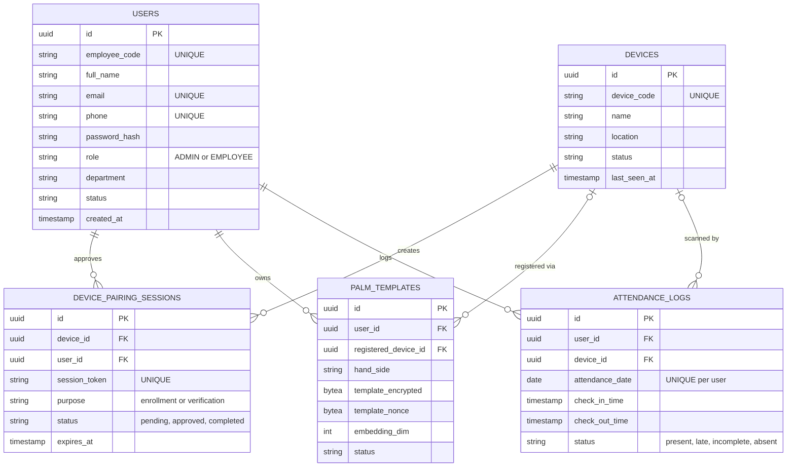

### 3.1 Chen's E-R Notation

Here is the database structure of the Palm Recognition Attendance System modeled in Chen's E-R notation style:

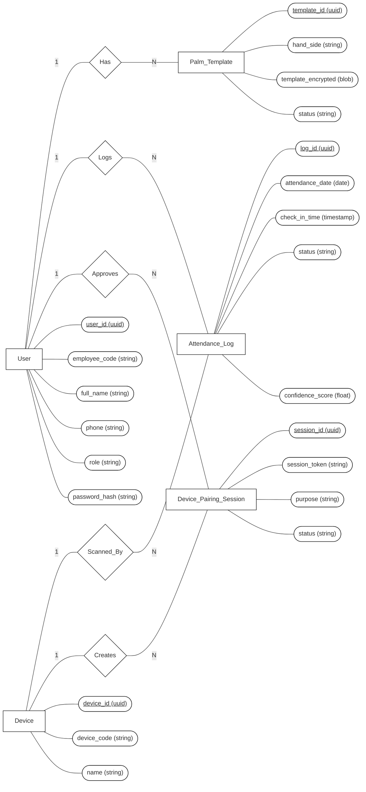

<b>ຮູບທີ 3.20 ສະແດງຮູບ E-R Model</b>

### Understanding the Relationships:
* **Users & Palm Templates (1-to-Many):** One user can have multiple palm templates (e.g., left hand, right hand).
* **Users & Attendance (1-to-Many):** One user has many attendance logs (one per day).
* **Devices & Sessions (1-to-Many):** A device generates unique pairing sessions (QR codes) for users to scan.
* **Devices & Attendance (1-to-Many):** A device processes many attendance check-ins.

---

## 4. Process Hierarchy Chart

The Process Hierarchy Chart (or Functional Decomposition Diagram) breaks down the entire system into its core functional modules and their sub-processes.

```mermaid
flowchart TD
    %% Main System
    System[ລະບົບຢືນຢັນຕົວຕົນດ້ວຍລາຍຝາມື]:::root
    
    %% Level 1 Modules
    System --> UM[1. ການຈັດການຂໍ້ມູນຜູ້ໃຊ້]:::module
    System --> DM[2. ການຈັດການອຸປະກອນ]:::module
    System --> PE[3. ການລົງທະບຽນລາຍຝາມື]:::module
    System --> AP[4. ປະມວນຜົນການລົງເວລາ]:::module
    System --> RA[5. ການລາຍງານ ແລະ ວິເຄາະ]:::module
    
    %% Level 2 Processes
    UM --> UM1[1.1 ການຢືນຢັນຕົວຕົນຜູ້ໃຊ້]:::process
    UM --> UM2[1.2 ຈັດການຂໍ້ມູນສ່ວນຕົວ]:::process
    UM --> UM3[1.3 ຈັດການສະຖານະການເຂົ້າໃຊ້]:::process
    UM --> UM4[1.4 ຍົກເລີກຂໍ້ມູນລາຍຝາມື]:::process
    
    DM --> DM1[2.1 ລົງທະບຽນເຄື່ອງສະແກນ]:::process
    DM --> DM2[2.2 ອັບເດດການຕັ້ງຄ່າ]:::process
    DM --> DM3[2.3 ຕິດຕາມສະຖານະອຸປະກອນ]:::process
    
    PE --> PE1[3.1 ສ້າງ QR Code ສໍາລັບເຊດຊັນ]:::process
    PE --> PE2[3.2 ກວດສອບ QR ໃນແອັບ]:::process
    PE --> PE3[3.3 ການອະນຸມັດຈາກຜູ້ດູແລ]:::process
    PE --> PE4[3.4 ບັນທຶກ ແລະ ເຂົ້າລະຫັດລາຍຝາມື]:::process
    
    AP --> AP1[4.1 ສະກັດເວັກເຕີລາຍຝາມື]:::process
    AP --> AP2[4.2 ປຽບທຽບຂໍ້ມູນທາງຊີວະມິຕິ]:::process
    AP --> AP3[4.3 ບັນທຶກສະຖານະການລົງເວລາ]:::process
    
    RA --> RA1[5.1 ກະດານຄວບຄຸມຜູ້ດູແລ]:::process
    RA --> RA2[5.2 ສ້າງລາຍງານ]:::process
    RA --> RA3[5.3 ເບິ່ງປະຫວັດຂອງອົງກອນ]:::process
    RA --> RA4[5.4 ເບິ່ງປະຫວັດສ່ວນຕົວ]:::process

    %% Styling
    classDef root fill:#1e293b,stroke:#000,stroke-width:2px,color:#fff,font-weight:bold
    classDef module fill:#3b82f6,stroke:#1e40af,stroke-width:1px,color:#fff,font-weight:bold
    classDef process fill:#f8fafc,stroke:#94a3b8,stroke-width:1px,color:#334155
```

---

## 5. Data Flow Diagrams (DFD)

Data Flow Diagrams map out how information flows through the system, from external entities (users/devices) into processes and data stores.

### 5.1 DFD Level 0 (Context Diagram)
The Context Diagram provides a bird's-eye view of the entire system as a single process, showing its interactions with external entities.

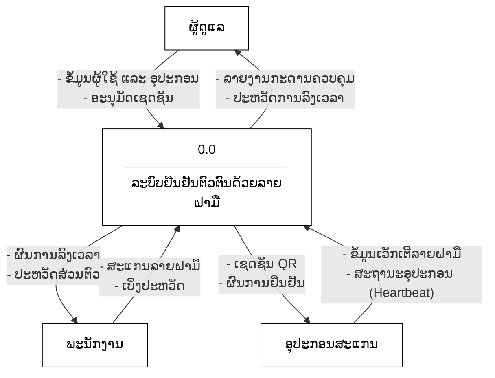

### 5.2 DFD Level 1 (Main Processes)
Level 1 breaks down the main system into its primary sub-processes and shows how they interact with the database stores.

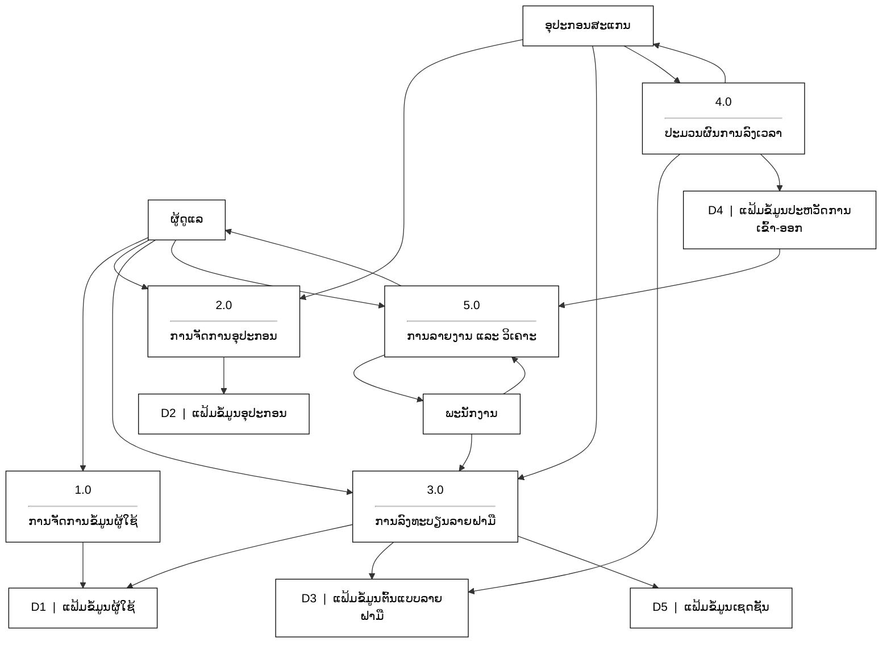

### 5.3 DFD Level 2 (Process Decomposition)
Below are the decomposed Data Flow Diagrams for each of the main processes (1.0 to 4.0), showing the specific sub-processes involved.

#### Process 1: User Management
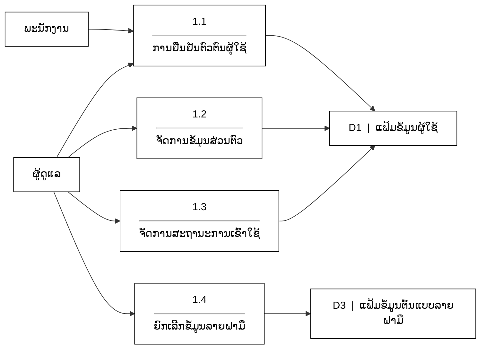

#### Process 2: Device Management
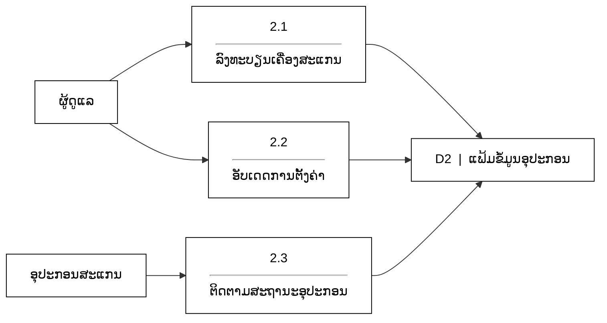

#### Process 3: Palm Enrollment
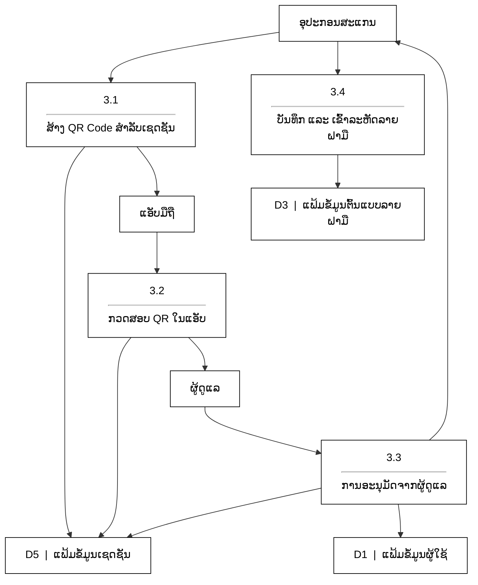

#### Process 4: Attendance Processing
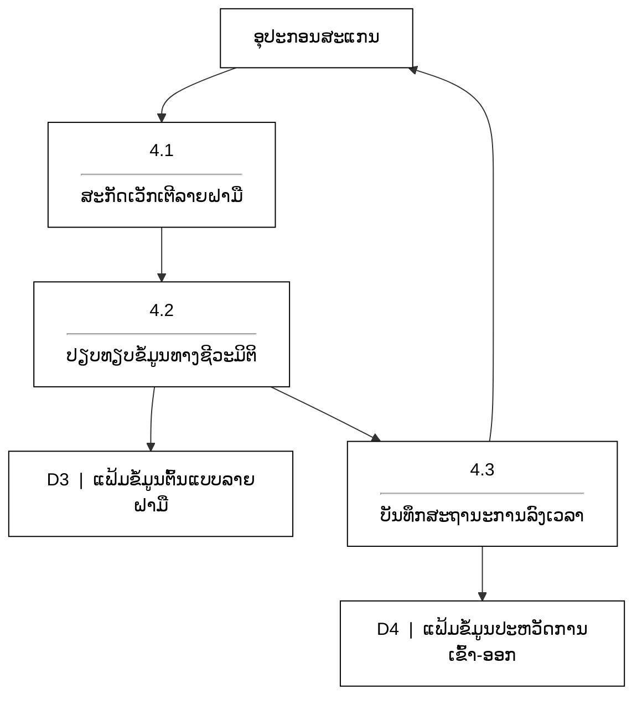

#### Process 5: Reporting & Analytics
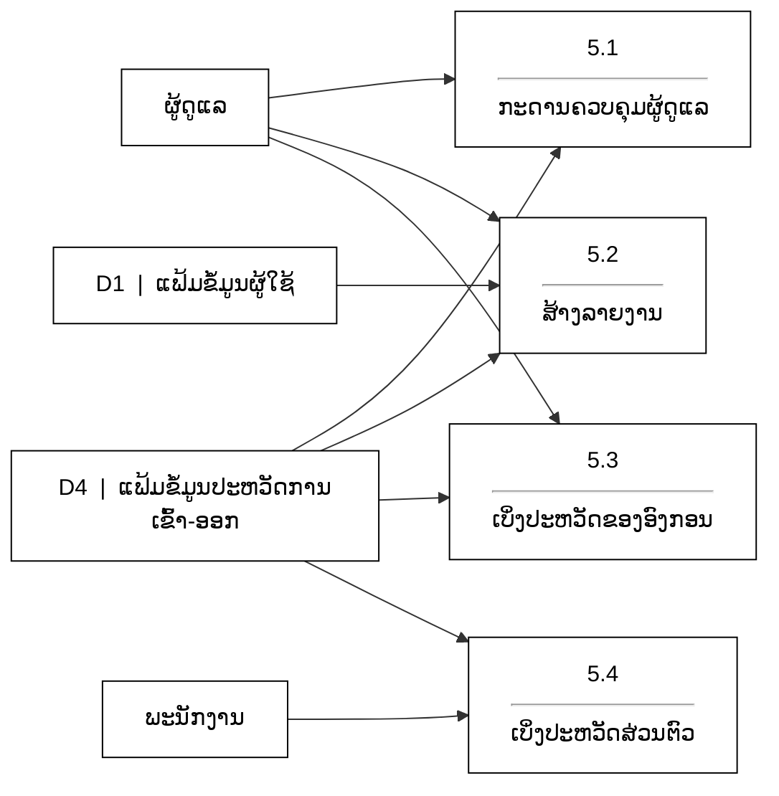

---

### 6. Data Dictionary (ພົດຈະນານຸກົມຂໍ້ມູນ)

ຕາຕະລາງລຸ່ມນີ້ອະທິບາຍໂຄງສ້າງຂອງຖານຂໍ້ມູນທັງ 5 ຕາຕະລາງທີ່ໃຊ້ໃນລະບົບ, ເຊິ່ງປະກອບມີລາຍລະອຽດຂອງຟິວ, ປະເພດຂໍ້ມູນ, ຂໍ້ກໍານົດຕ່າງໆ, ແລະ ຄວາມສຳພັນ.

### 6.1 `users`
ເກັບຂໍ້ມູນໂປຣໄຟລ໌ຂອງພະນັກງານ ແລະ ຜູ້ດູແລລະບົບທັງໝົດ.

| ຊື່ຟິວ (Column) | ປະເພດຂໍ້ມູນ (Type) | ຂໍ້ກຳນົດ (Constraints) | ຄຳອະທິບາຍ (Description) |
|---|---|---|---|
| `id` | UUID | Primary Key | ລະຫັດສະເພາະສຳລັບຜູ້ໃຊ້ |
| `employee_code` | VARCHAR(50) | Unique, Not Null | ລະຫັດພະນັກງານ |
| `full_name` | VARCHAR(100) | Not Null | ຊື່ ແລະ ນາມສະກຸນຂອງຜູ້ໃຊ້ |
| `email` | VARCHAR(100) | Unique | ທີ່ຢູ່ອີເມວຂອງຜູ້ໃຊ້ |
| `phone` | VARCHAR(20) | Unique | ເບີໂທລະສັບຂອງຜູ້ໃຊ້ |
| `password_hash` | VARCHAR(255) | Not Null | ລະຫັດຜ່ານທີ່ຖືກເຂົ້າລະຫັດແບບ Bcrypt |
| `role` | VARCHAR(20) | Default 'EMPLOYEE' | ກຳນົດສິດເປັນ 'ADMIN' ຫຼື 'EMPLOYEE' |
| `department` | VARCHAR(50) | | ພະແນກທີ່ຜູ້ໃຊ້ສັງກັດຢູ່ |
| `status` | VARCHAR(20) | Default 'active' | ສະຖານະບັນຊີຜູ້ໃຊ້ (active/inactive) |
| `created_at` | TIMESTAMP | Default NOW() | ເວລາທີ່ສ້າງໂປຣໄຟລ໌ |
| `updated_at` | TIMESTAMP | Default NOW() | ເວລາທີ່ມີການອັບເດດໂປຣໄຟລ໌ລ່າສຸດ |

### 6.2 `devices`
ເກັບຂໍ້ມູນອຸປະກອນສະແກນຮາດແວທີ່ລົງທະບຽນໃນລະບົບ.

| ຊື່ຟິວ (Column) | ປະເພດຂໍ້ມູນ (Type) | ຂໍ້ກຳນົດ (Constraints) | ຄຳອະທິບາຍ (Description) |
|---|---|---|---|
| `id` | UUID | Primary Key | ລະຫັດສະເພາະສຳລັບອຸປະກອນ |
| `device_code` | VARCHAR(50) | Unique, Not Null | ໝາຍເລກເຄື່ອງ ຫຼື ລະຫັດຮາດແວ |
| `name` | VARCHAR(100) | Not Null | ຊື່ອຸປະກອນ (ເຊັ່ນ: "ເຄື່ອງສະແກນໜ້າປະຕູ") |
| `location` | VARCHAR(100) | | ສະຖານທີ່ຕັ້ງຂອງອຸປະກອນ |
| `status` | VARCHAR(20) | Default 'active' | ສະຖານະການເຮັດວຽກຂອງອຸປະກອນ |
| `last_seen_at` | TIMESTAMP | | ເວລາລ່າສຸດທີ່ອຸປະກອນເຊື່ອມຕໍ່ກັບເຊີບເວີ |
| `created_at` | TIMESTAMP | Default NOW() | ເວລາທີ່ລົງທະບຽນ |

### 6.3 `device_pairing_sessions`
ເຊດຊັນຊົ່ວຄາວທີ່ສ້າງຂຶ້ນເມື່ອເຄື່ອງສະແກນສ້າງ QR code ສຳລັບລົງທະບຽນລາຍຝາມື.

| ຊື່ຟິວ (Column) | ປະເພດຂໍ້ມູນ (Type) | ຂໍ້ກຳນົດ (Constraints) | ຄຳອະທິບາຍ (Description) |
|---|---|---|---|
| `id` | UUID | Primary Key | ລະຫັດເຊດຊັນ |
| `device_id` | UUID | Foreign Key | ເຄື່ອງສະແກນທີ່ສ້າງເຊດຊັນນີ້ |
| `session_token` | TEXT | Unique, Not Null | ໂທເຄັນທີ່ຝັງຢູ່ໃນ QR code |
| `user_id` | UUID | Foreign Key | ຜູ້ໃຊ້ທີ່ອະນຸມັດເຊດຊັນນີ້ |
| `purpose` | VARCHAR(50) | Not Null | ຈຸດປະສົງ (ປົກກະຕິແມ່ນ 'enrollment') |
| `status` | VARCHAR(30) | Default 'pending' | ສະຖານະ (pending, approved, completed) |
| `expires_at` | TIMESTAMP | Not Null | ເວລາທີ່ QR code ໝົດອາຍຸ |
| `scanned_at` | TIMESTAMP | | ເວລາທີ່ຜູ້ໃຊ້ສະແກນ QR |
| `approved_at` | TIMESTAMP | | ເວລາທີ່ຜູ້ໃຊ້ກົດ "ອະນຸມັດ" |
| `completed_at` | TIMESTAMP | | ເວລາທີ່ຂໍ້ມູນເວັກເຕີລາຍຝາມືຖືກບັນທຶກ |
| `created_at` | TIMESTAMP | Default NOW() | ເວລາທີ່ສ້າງເຊດຊັນ |

### 6.4 `palm_templates`
ເກັບຮັກສາຂໍ້ມູນເວັກເຕີຊີວະມິຕິທີ່ຖືກເຂົ້າລະຫັດຢ່າງປອດໄພ.

| ຊື່ຟິວ (Column) | ປະເພດຂໍ້ມູນ (Type) | ຂໍ້ກຳນົດ (Constraints) | ຄຳອະທິບາຍ (Description) |
|---|---|---|---|
| `id` | UUID | Primary Key | ລະຫັດຕົ້ນແບບ |
| `user_id` | UUID | Foreign Key, Not Null | ເຈົ້າຂອງຕົ້ນແບບນີ້ |
| `hand_side` | VARCHAR(10) | Not Null | ມືຊ້າຍ ຫຼື ມືຂວາ ('left' ຫຼື 'right') |
| `template_encrypted` | BYTEA | Not Null | ຂໍ້ມູນເວັກເຕີທີ່ເຂົ້າລະຫັດດ້ວຍ AES-256 |
| `template_nonce` | BYTEA | Not Null | Nonce ທີ່ໃຊ້ສຳລັບຖອດລະຫັດ |
| `embedding_dim` | INT | Default 128 | ຂະໜາດຂອງເວັກເຕີ (ມິຕິ) |
| `model_version` | VARCHAR(100) | Not Null | ໂມເດວ AI ທີ່ໃຊ້ສະກັດຂໍ້ມູນ |
| `threshold` | NUMERIC(5,4) | Default 0.8200 | ຄ່າຄວາມແມ່ນຍຳ (Threshold) ສຳລັບຕົ້ນແບບນີ້ |
| `status` | VARCHAR(30) | Default 'active' | ສະຖານະຂອງຕົ້ນແບບ |
| `registered_device_id`| UUID | Foreign Key | ອຸປະກອນທີ່ໃຊ້ບັນທຶກຕົ້ນແບບ |
| `created_at` | TIMESTAMP | Default NOW() | ເວລາທີ່ລົງທະບຽນ |
| `updated_at` | TIMESTAMP | Default NOW() | ເວລາທີ່ມີການອັບເດດລ່າສຸດ |
| `revoked_at` | TIMESTAMP | | ເວລາທີ່ຕົ້ນແບບຖືກຍົກເລີກ (ຖ້າມີ) |

### 6.5 `attendance_logs`
ບັນທຶກປະຫວັດການເຂົ້າ-ອອກວຽກປະຈຳວັນຂອງຜູ້ໃຊ້ທັງໝົດ.

| ຊື່ຟິວ (Column) | ປະເພດຂໍ້ມູນ (Type) | ຂໍ້ກຳນົດ (Constraints) | ຄຳອະທິບາຍ (Description) |
|---|---|---|---|
| `id` | UUID | Primary Key | ລະຫັດປະຫວັດ |
| `user_id` | UUID | Foreign Key, Not Null | ພະນັກງານທີ່ລົງເວລາ |
| `device_id` | UUID | Foreign Key | ເຄື່ອງສະແກນທີ່ໃຊ້ລົງເວລາ |
| `attendance_date` | DATE | Not Null | ວັນທີຂອງການລົງເວລາ |
| `check_in_time` | TIMESTAMP | | ເວລາທີ່ສະແກນຄັ້ງທຳອິດ (ເຂົ້າວຽກ) |
| `check_out_time` | TIMESTAMP | | ເວລາທີ່ສະແກນຄັ້ງລ່າສຸດ (ອອກວຽກ) |
| `check_in_score` | NUMERIC(6,5) | | ຄະແນນຄວາມໝັ້ນໃຈທາງຊີວະມິຕິ (0-1) |
| `check_out_score`| NUMERIC(6,5) | | ຄະແນນຄວາມໝັ້ນໃຈທາງຊີວະມິຕິ (0-1) |
| `check_in_liveness`| BOOLEAN | Default false | ຜ່ານການກວດສອບການປອມແປງຈາກຮາດແວ |
| `check_out_liveness`| BOOLEAN | Default false | ຜ່ານການກວດສອບການປອມແປງຈາກຮາດແວ |
| `status` | VARCHAR(20) | Default 'present' | ສະຖານະ (present, late, incomplete, absent) |
| `created_at` | TIMESTAMP | Default NOW() | ເວລາທີ່ສ້າງປະຫວັດນີ້ |

*(Note: `user_id` + `attendance_date` is a UNIQUE compound key to prevent duplicate daily records).*

---

## 7. Step-by-Step Flowcharts

These flowcharts break down the exact step-by-step logic and decision paths for the system as a whole, and for each specific role (Admin, Employee, and Hardware Device).

### 7.1 System Overview Flowchart
This shows the high-level life cycle from system setup to daily usage.

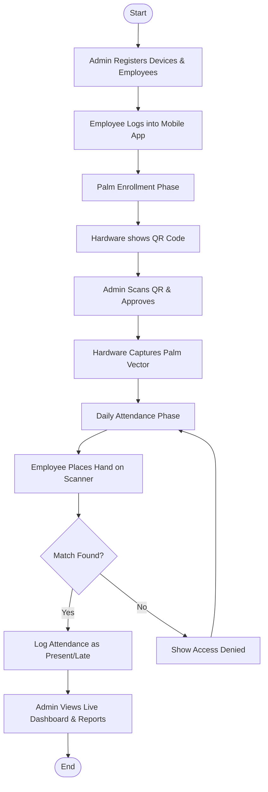

### 7.2 Admin Flowchart
The step-by-step flow for an Administrator using the Web Dashboard.

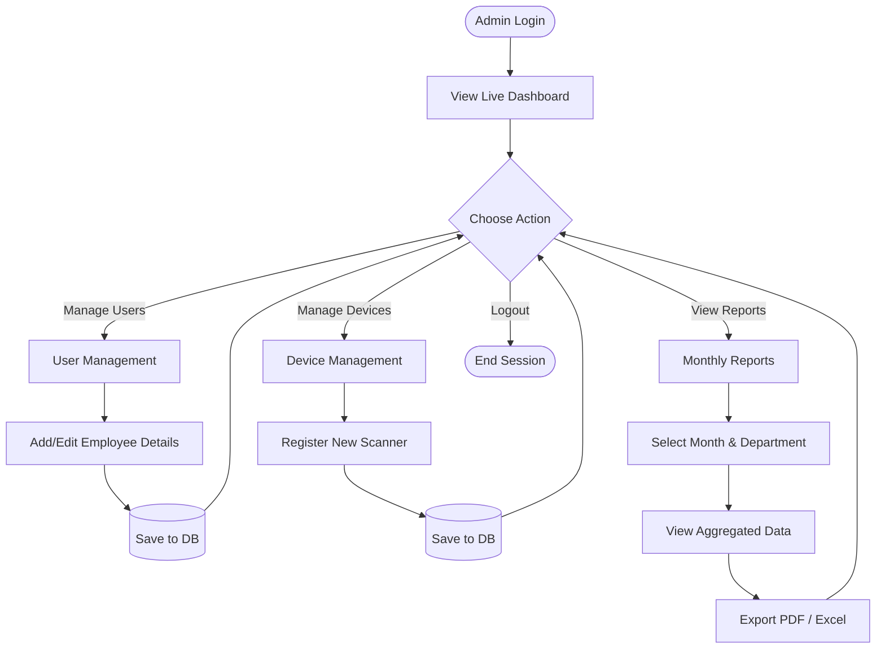

### 7.3 Employee Flowchart
The step-by-step flow for an Employee using the Mobile App.

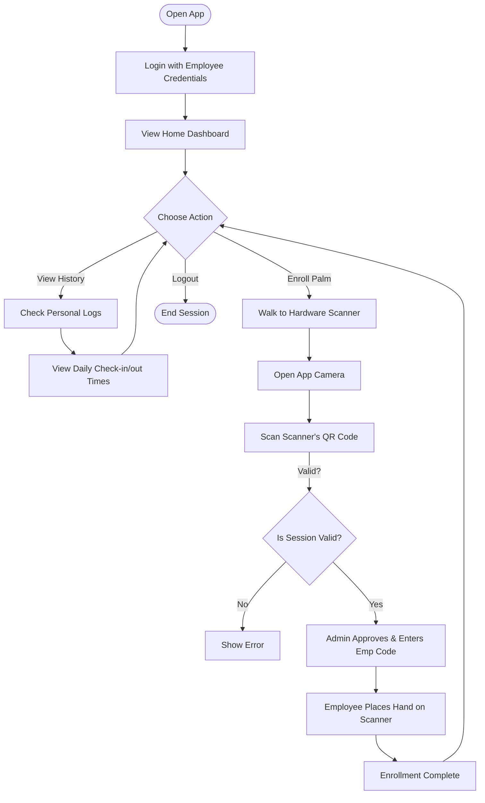

### 7.4 Hardware Device (Raspberry Pi) Flowchart
The step-by-step operational loop of the physical scanning device.

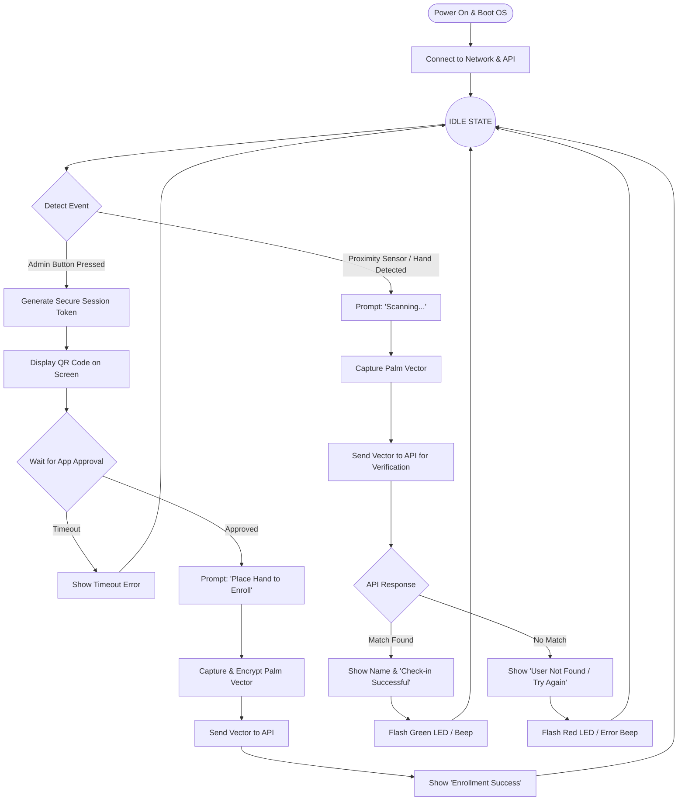
